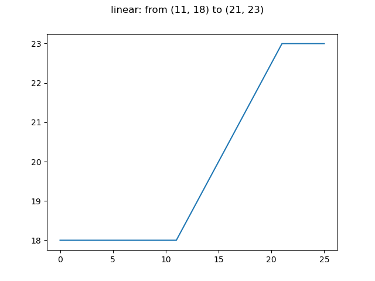
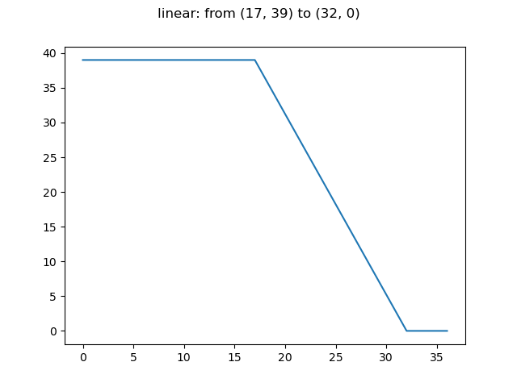
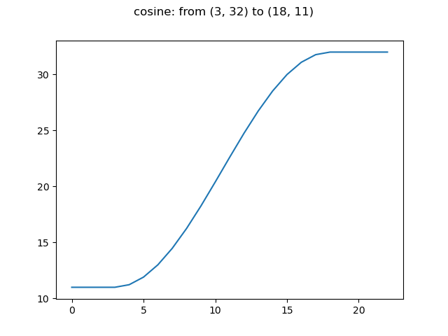
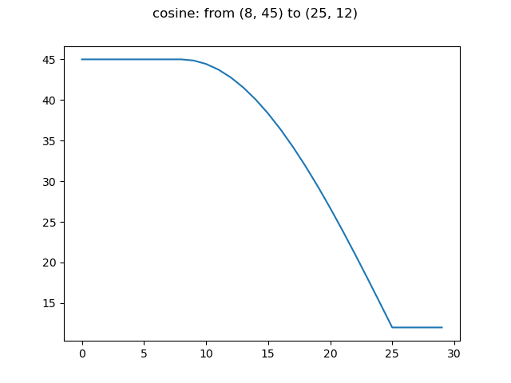
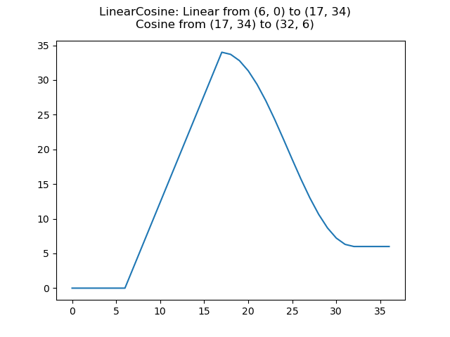

# Scheduler Utils

Implements some scheduling functions to decay or ramp values across timestamps.  

Install with: `pip install scheduling_utils`

To initialize and use for example a cosine scheduler, do the following: 

```
from schedulers import CosineScheduler

start_step = 0
stop_step = 10

start_value = 5
stop_value = 20

scheduler = CosineScheduler(start_step, stop_step, start_value, stop_value)

# get values corresponding to step
for step in range(10):
    value = scheduler.step(step)
```

Available Schedulers at current version:
- Linear
    
    
- Cosine
    
    
- LinearCosine
    
 