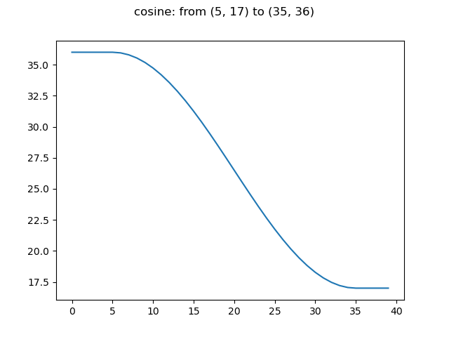

# LR Schedulers with C++ extensions

Implements some LR scheduling functions to decay or ramp values across timestamps.  

### Install
Install with: `pip install scheduling_utils`

### Usage
Each scheduler is available with full python code or c++ code 
([ctypes](https://docs.python.org/3/library/ctypes.html) is used for binding) 
wrapped into python classes.  
To initialize and use for example a cosine scheduler, do the following: 

```
# import the c++ cosine scheduler
from schedulers_cpp import CosineScheduler

# use this to use the full python version
# from schedulers import CosineScheduler

start_step = 0
stop_step = 10

start_value = 5
stop_value = 20

scheduler = CosineScheduler(start_step, stop_step, start_value, stop_value)

# get values corresponding to step
for step in range(10):
    value = scheduler.step(step)
```

### Available Schedulers
Available Schedulers at current version:
- Linear:

    
    

- Cosine:

    
    

- LinearCosine:

    
 